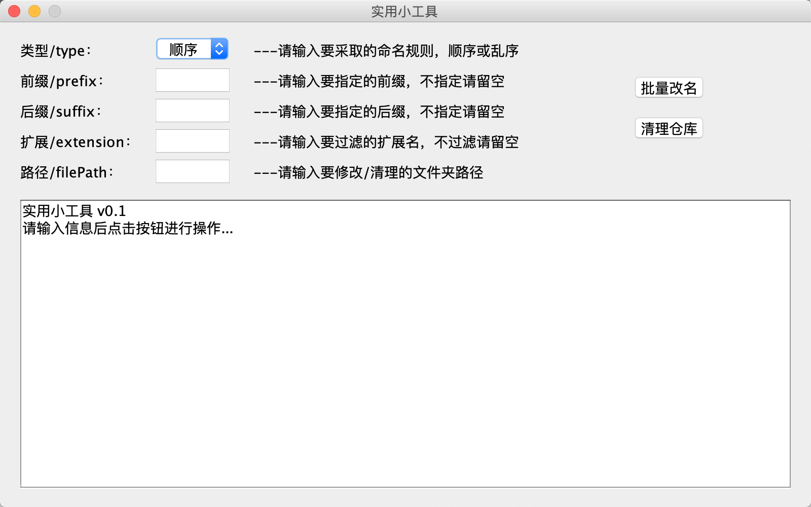

# Common-Utils

### FileBatchRename

文件批量重命名工具，支持多级文件夹命名

*   支持顺序命名和乱序命名

    *   顺序命名使用 1，2，3，......命名，同一文件夹内的保持从1开始命名，
    *   乱序命名使用 UUID 命名（去除生成的 UUID 中的 "-"）
    *   todo：添加更多重命名方式

*   支持按扩展名过滤，只重命名某一类型的文件

*   支持添加自定义后缀和前缀

  ​    

### RepositoryClean

Maven 仓库清理工具，清理 Maven 仓库中的以下内容

*   以 ".lastupdated" 结尾的未完成的文件

*   缺失以 ".jar" 结尾的文件的文件夹，只有 pom 等文件

*   空文件夹

    

### BinaryConverter

一个进制转换器，输入一个任意进制(M)的数字(X)和想要转换的进制(N)，输出目标进制的结果(Y)

 * 总的进制范围限定二～十六进制，十一进制到十六进制中，10～15分别使用A~F表示
     1.  将10进制转换为任意进制(M=10)
     2.  从任意进制转换为10进制(N=10)
     3.  将任意进制转换为任意进制（此时十进值的中间变量设为z）

### Java Interface

